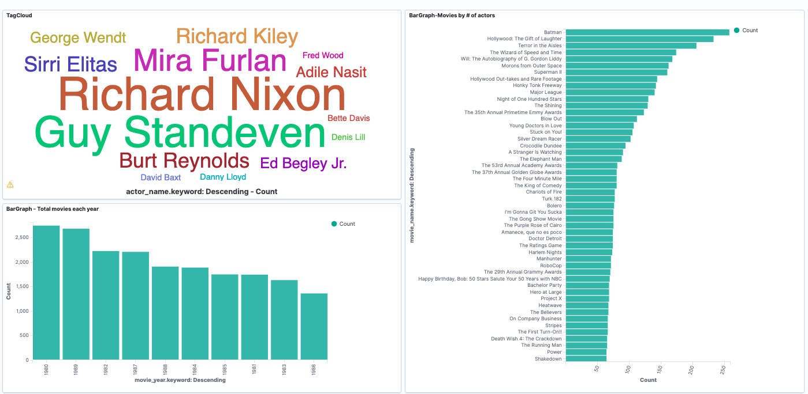
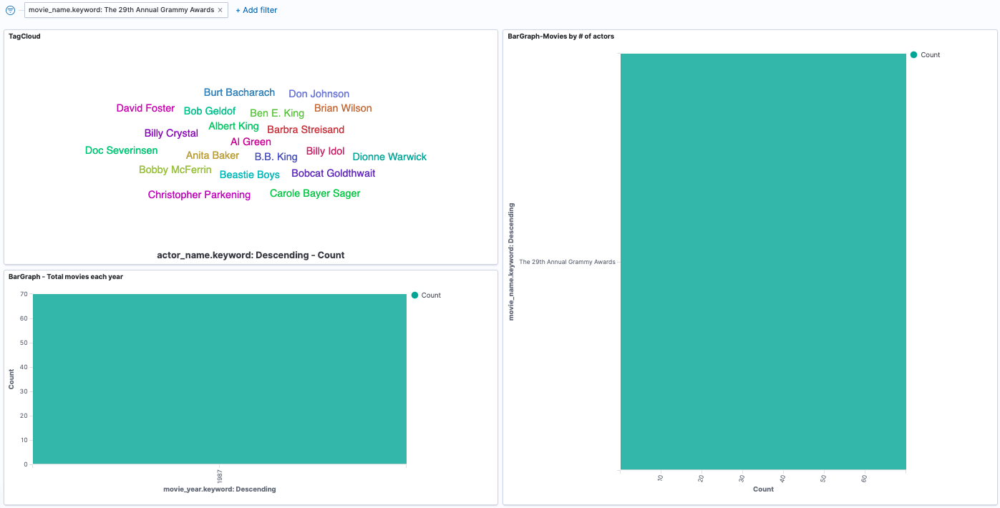
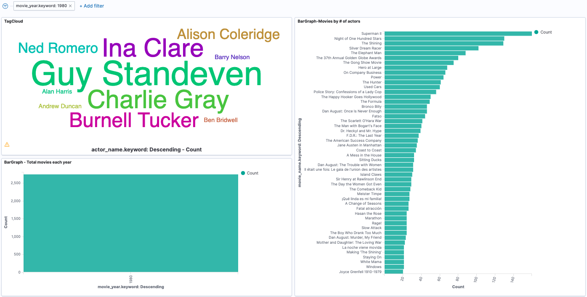
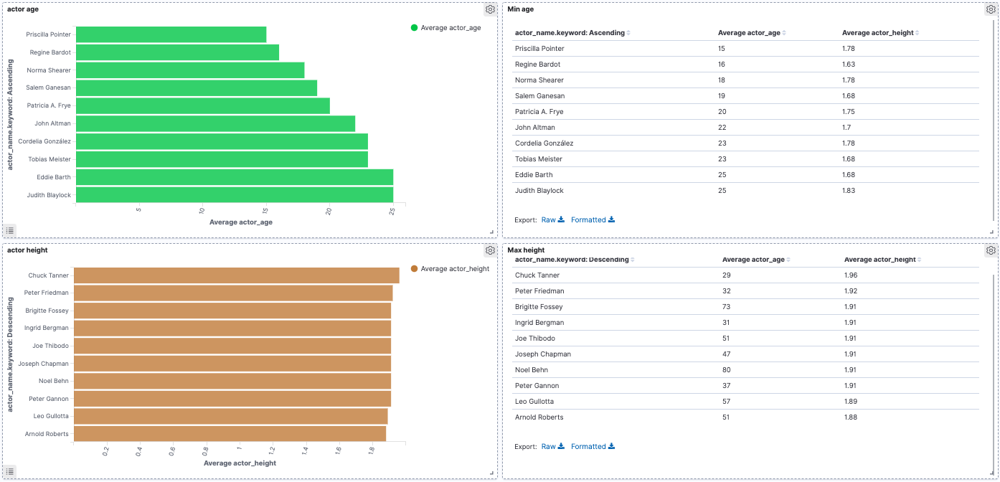

# CLOUD-COMPUTING-CLASS-2020-Lab7

## Using the Elastic Stack to study scraped data from a web page

## Task 7.1 Extract selected information from a newspaper webpage

Q71: Add the above code to your scrapy-lab repository. Add the nytimes.json, containing the output of your execution, to the Lab7 folder of your answers repository. (20% of total grade for this lab session) 
Updated [here] (https://github.com/ishaanrd/scrapy-lab/blob/master/nyt_scraper/nyt_scraper/spiders/nytimes.py)

Q72: Add the code of the new spider your scrapy-lab repository. Add the imdb.json, containing the output of your execution, to the Lab7 folder of your answers repository. (30% of total grade for this lab session)
Updated [here] (https://github.com/ishaanrd/scrapy-lab/blob/master/imdbscraper/imdbscraper/spiders/imdb.py). The yield statement has been commented out as the same spyder code was used for Q74.

Q73: Take a screenshot of the Kibana Dashboard showing the above plots without filters. Set a couple of filters, take screetshots. Add all the screenshots to the Lab7 folder of your answers repository. (20% of total grade for this lab session)
Below is the screenshot of the dashboard with the 3 visualisations included. We can observe that the most popular actors in the 80s were Richard Nixon , Guy Standeven and Olivia Newton-John. The movie that employed most actors is 'Batman', while the top 10 in the category include 'Superman II' and 'The Shining'. On the annual movies chart below, we notice that 1980 saw the highest number of releases, closely followed by 1989, while 1986 had the fewest releases.

We have considered Award ceremonies that are televised as movies as well. On applying the filter for Grammy awards, we observe popular musicians such as B.B. King, Barbara Streisand and Beastie Boys popping up in the tag cloud, albiet in small sizes since they are not primarily actors.

On selecting 1980 (the year with most releases) as a filter, Ralph G. Morse and Charlie Gray pop up in tag cloud, alongside Guy Standeven. The movies with largest cast includes Superman II and The Shining, that stand out throughout the decade in this category.

Q74: Explain what you have done in the README.md file of the Lab7 folder of your answers repository, add the new plot. Push the code changes to your scrapy-lab repository (30% of total grade for this lab session)
We are interested in understanding the physical features of actors including their age and height during the 80s. For this purpose, we have scrapped the bio page of actors to obtain these details and prepared a Dashboard that list the tallest actors and youngest actors, alongwith their height and age.
Please note that the same scraper has been used for this task as in Q73, and hence the yield statments have been commented out.

Q75: How long have you been working on this session? What have been the main difficulties you have faced and how have you solved them? Add your answers to Lab7/README.md of your Lab answers repository.
We spent nearly 12 hours on this session. A majority of time was spent in understanding the CSS code on the webpages and writing statements for extracting the required details.
